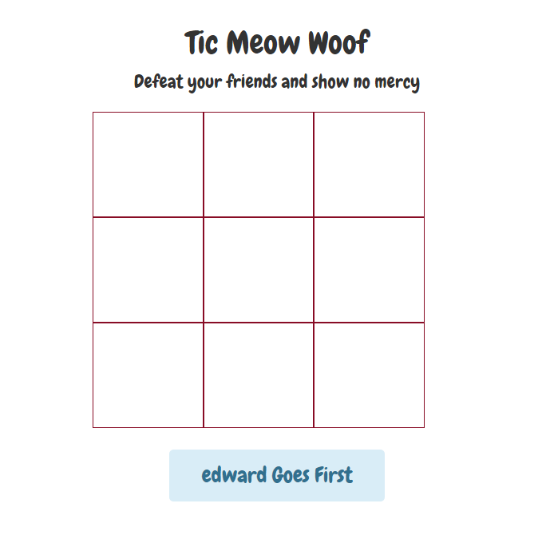

# CS52 Preprocessors Workshop (Coffeescript & Flow)

Hi everyone!  Welcome to the CS52 workshop on preprocessors, with a focus on *CoffeeScript* and *Flow*.  Here, you will learn the basics of using both by...

:rocket: Creating AND debugging a simple game of Tic-Tac-Toe!  

(Debugging might make you :running: right now, follow this workshop and you will be :metal:)

# What are preprocessors?

Preprocessors are programs that takes in data and outputs it into a form that can be read by another, more common program.  In this case, there are many preprocessors for JavaScript that make the language more efficient and less buggy.  

*CoffeeScript* is JavaScript but :punch: better :punch: - or at least, it's supposed to be!  It is:

- **Faster and more efficient** - comparing a CoffeeScript file to the JavaScript it outputs, the former saves 33% to 50% of characters to be typed.
- Seamlessly **connects to any existing JavaScript library**.
- **Compiles one to one** to the equivalent JS
- Results in **less errors** (e.g. variables are auto-scoped, so you won't be overwriting global variables by omitting `var`)

*Flow* uses data flow analysis to :running: follow :running: you in your code writing, pointing out errors as you go.  Like your parents, but more helpful! :information_desk_person:  

It works incrementally, meaning you can add it file-by-file instead of jumping right into the deep end of the pool.  We won't be doing much with it for this interactive portion of our workshop, but check it out and see if it will help you in your own coding!

## Clone the Repo!
To start off, clone this repo - you should already know how to do that, but if not, just `git clone [HTTPS for this repo.]`

Now, you should have the base code for the game we are going to make!  Some parts will be left out, marked by comments that say `TO-DO:` - you'll be filling in those lines of code as you move through this workshop.

## Getting started with CoffeeScript
It's pretty easy to install CoffeeScript: `npm install -g coffee-script` will get you the latest edition.  Run the command `coffee -v` to check your download.  Good?  Let's go!

CoffeeScript files have the extension of `.coffee` and compile into `.js`.  

#### Cool Command

You don't need this in this workshop (more for bigger projects and organization) but something to keep in mind:

`coffee -o javascripts/ -c coffeescripts/` will compile all the files in the folder 'coffeescripts' and output them into a folder 'javascripts'.  **Don't switch the order of -o and -c!**

## Tic-Tac-Toe Game

In the `logic` folder, you will see a file named `app.coffee`.  This holds a great deal of code that has already been created, but you will be filling in the blanks that are indicated by comments!  You will be editing this file, but in the HTML `index.html` in the root folder, **link** instead to the `app.js` file it compiles.

:rocket: At the very end of the  `<body>`, right before the closing tags, paste: <br>
`<script src="logic/app.js"></script>`.

### Now, let's initiate our game.  

:rocket: Find the comment that says `#Insert initialization code here`.  You will be pasting the following code at that location: <br>

```
initialize: ->
  @data.gameOver = false
  @setPlayerNames()
  @assignRoles()
  @prepareBoard()
  @updateNotifications()
  @addListeners()
```

What are we doing? The equivalent JavaScript is:

```
initialize: function() {
  this.data.gameOver = false;
  this.setPlayerNames();
  this.assignRoles();
  this.prepareBoard();
  this.updateNotifications();
  return this.addListeners();
},
```

Notice that the general structure of the CoffeeScript is the same as VanillaJS, but eliminates a lot of the verbose syntax such as semicolons and braces. In addition, note that in coffee, "->" replaces "function()" and "@" replaces "this."

How will we decide which player goes first?  Let's write a function to do that.  The following code will be familiar, but a lot shorter than we would write in JS!

:rocket: Find the comment that says `#Insert function to decide who goes first`.  You will be pasting the following code at that location: <br>

```
assignRoles: ->
  roles = ["X","O"].sort(->
    return 0.5 - Math.random()
  )
  @data.rolep1 = roles[0]
  @data.rolep2 = roles[1]
```

Let's compile our code to see where we are at! Run the following command in terminal: `coffee -c logic/app.coffee`

You should get the following image when you start it up with `python -m SimpleHTTPServer 9000`:




### Now, let's give our players the ability to make some moves.

:rocket: Find the comment that says `#Insert script to make moves`.  You will be pasting the following code at that location: <br>

```
addListeners: ->
  $(".square").click ->
    if Tic.data.gameOver is no and not $(@).text().length
      if Tic.data.turns % 2 is 0 then $(@).html("X").addClass("x moved")
      else if Tic.data.turns % 2 isnt 0 then $(@).html("O").addClass("o moved")
      Tic.data.turns++
      Tic.checkEnd()
      if Tic.data.gameOver isnt yes and $(".moved").length >= 9 then Tic.checkTie("none")
```
Note that this method is significantly more simple than the JS equivalent. This is primarily due to the conditional keywords "is", "and", "not", "then".

Compile the code again and you should be able to see the game update as you make moves!

### Now, let's see if a player has won.

In a Tic-Tac-Toe game, you can win by getting three horizontally, vertically, or diagonally.  We will have several functions, each checking for a completion of one of the three.  If any of these has been reached by either player, the game ends and a winning message is displayed.

:rocket: Find the comment that says `#Insert checkEnd here!`. You will be pasting the following code at that location: <br>

```
checkEnd : ->
  @data.x = {}
  @data.o = {}

  #diagonal check
  diagonals = [[0,4,8], [2,4,6]]
  for diagonal in diagonals
     for col in diagonal
       @checkField(col, 'diagonal')
     @checkWin()
     @emptyStorageVar('diagonal')
  for row in [0..2]
    start = row * 3
    end = (row * 3) + 2
    middle = (row * 3) + 1

    #vertical check
    @checkField(start, 'start')
    @checkField(middle, 'middle')
    @checkField(end, 'end')
    @checkWin()

    # horizontal check
    for column in [start..end]
      @checkField(column, 'horizontal')
    @checkWin()
    @emptyStorageVar('horizontal')
```

What's going on here?  First of all, note that variable definition are a lot easier in CoffeeScript. Also note that for loops are simplified and uses ".." to indicate a range of values.

### One more thing... the Modal!

Let's get that winning message to pop up!  

:rocket: Find the comment that says `#Insert modal content here`. You will be pasting the following code at that location: <br>

```
modal = document.getElementById('myModal')
btn = document.getElementById("myBtn")
span = document.getElementsByClassName("close")[0]

span.onclick = ->
  modal.style.display = "none"

window.onclick = (event) ->
  if event.target == modal
    modal.style.display = "none"
```

And that's it! Feel free to take it one step further and use jQuery for the last step. Compile one last time, and then deploy your hard work. Congratulations on making your first (?) CoffeeScript Tic-Tac-Toe game!

## And You're Done!
At this point you should have ...
- [ ] Set up flow
- [ ] Started with CoffeeScript
- [ ] Worked your way through the Tic-Tac-Toe game
- [ ] Understand how these programs work the way they do!

## Credits
Tic-tac-toe modified from http://www.sitepoint.com/practical-coffeescript-tic-tac-toe
